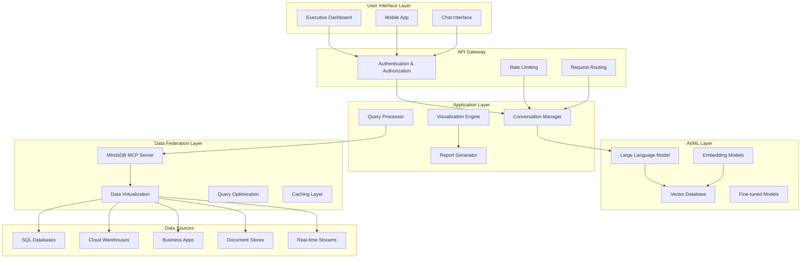

# Co-Planning: AI C-Level Assistant Chatbot Application
- [Co-Planning: AI C-Level Assistant Chatbot Application](#co-planning-ai-c-level-assistant-chatbot-application)
  - [Executive Summary](#executive-summary)
  - [0. User Problems \& Solutions Overview](#0-user-problems--solutions-overview)
    - [Core Problems C-Level Executives Face with Traditional Chatbots:](#core-problems-c-level-executives-face-with-traditional-chatbots)
  - [1. Core Features \& Capabilities](#1-core-features--capabilities)
    - [1.1 Enterprise Data Federation](#11-enterprise-data-federation)
    - [1.2 Conversational Intelligence](#12-conversational-intelligence)
    - [1.3 Role-Based Access Control (RBAC)](#13-role-based-access-control-rbac)
    - [1.4 Advanced Analytics \& Visualization](#14-advanced-analytics--visualization)
    - [1.5 Strategic Decision Support](#15-strategic-decision-support)
    - [1.6 Enterprise Integration](#16-enterprise-integration)
  - [2. Proposed Solution Architecture](#2-proposed-solution-architecture)
    - [2.1 Data Layer](#21-data-layer)
    - [2.2 Application Layer](#22-application-layer)
    - [2.3 AI/ML Layer](#23-aiml-layer)
  - [2. Consolidated Problem-Solution-Demo Table](#2-consolidated-problem-solution-demo-table)
  - [3. System Architecture](#3-system-architecture)
    - [3.1 Component Details](#31-component-details)
  - [4. Demo Plan](#4-demo-plan)
    - [4.1 Demo Scenarios](#41-demo-scenarios)
    - [4.2 Demo Environment Setup](#42-demo-environment-setup)
    - [4.3 Demo Flow](#43-demo-flow)
  - [5. Evaluation Criteria \& Expected Results](#5-evaluation-criteria--expected-results)
    - [5.1 Functional Testing](#51-functional-testing)
    - [5.2 Performance Testing](#52-performance-testing)
    - [5.3 Security Testing](#53-security-testing)
    - [5.4 Usability Testing](#54-usability-testing)
    - [5.5 Integration Testing](#55-integration-testing)
    - [5.6 Business Value Metrics](#56-business-value-metrics)

## Executive Summary

Co-Planning is an enterprise-grade AI assistant designed specifically for C-level executives and senior management. 
It provides intelligent data analysis, conversational insights, and strategic decision support by federating data across the entire organization while maintaining strict role-based access controls.

## 0. User Problems & Solutions Overview

### Core Problems C-Level Executives Face with Traditional Chatbots:

1. **Data Fragmentation**: Data is scattered across multiple systems, both structured and unstructured
2. **Context Loss**: Chatbots lose conversation context, requiring repetitive explanations
3. **Security Gaps**: No role-based access control, exposing sensitive data inappropriately
4. **Limited Analytics**: Cannot generate meaningful visualizations or perform complex analysis
5. **Poor Business Understanding**: Generic chatbots don't understand business terminology or executive needs
6. **Integration Challenges**: Cannot connect to enterprise systems and data sources
7. **Shallow Insights**: Provide surface-level answers without strategic depth
8. **No Memory**: Cannot maintain conversation history across sessions
9. **Unclear Queries**: Cannot handle ambiguous requests or ask clarifying questions
10. **Static Responses**: Cannot adapt to different user roles or provide personalized experiences

## 1. Core Features & Capabilities

### 1.1 Enterprise Data Federation
- **Multi-Source Data Integration**: Connects to disparate data sources including:
  - Structured databases (SQL Server, PostgreSQL, MySQL, Oracle)
  - Cloud data warehouses (Snowflake, BigQuery, Redshift)
  - Business applications (Salesforce, HubSpot, SAP, NetSuite)
  - Document repositories (SharePoint, Google Drive, Confluence)
  - Real-time data streams (Kafka, event logs, IoT sensors)
  - Unstructured data (emails, PDFs, presentations, meeting transcripts)

- **Intelligent Data Discovery**: Automatically catalogs and indexes available data sources
- **Schema Mapping**: Creates unified semantic layer across heterogeneous data sources
- **Real-time Synchronization**: Maintains up-to-date information across all connected systems

### 1.2 Conversational Intelligence
- **Context-Aware Memory**: Maintains conversation history and context across sessions
- **Multi-Turn Dialogue**: Supports complex, evolving conversations with follow-up questions
- **Clarification Requests**: Proactively asks for clarification when queries are ambiguous
- **Intent Recognition**: Understands business context and executive-level concerns
- **Natural Language Processing**: Handles complex business terminology and domain-specific language

### 1.3 Role-Based Access Control (RBAC)
- **Hierarchical Permissions**: 
  - CEO: Full organizational data access
  - CFO: Financial, sales, and operational data
  - CTO: Technology, security, and infrastructure data
  - COO: Operational, supply chain, and performance data
  - Department Heads: Department-specific data with cross-functional visibility
- **Dynamic Access Control**: Permissions adjust based on data sensitivity and user context
- **Audit Trail**: Complete logging of data access and query patterns
- **Data Masking**: Automatic PII and sensitive data protection based on user roles

### 1.4 Advanced Analytics & Visualization
- **Interactive Charts**: Dynamic generation of charts, graphs, and dashboards
- **Predictive Analytics**: Trend analysis and forecasting capabilities
- **Comparative Analysis**: Cross-departmental and temporal comparisons
- **Executive Dashboards**: Real-time KPI monitoring and alerts
- **Data Storytelling**: Narrative explanations of data insights and trends
- **Export Capabilities**: Generate reports in multiple formats (PDF, Excel, PowerPoint)

### 1.5 Strategic Decision Support
- **Scenario Modeling**: What-if analysis for strategic planning
- **Risk Assessment**: Automated identification of potential business risks
- **Opportunity Detection**: Pattern recognition for growth opportunities
- **Competitive Intelligence**: Market and competitor analysis integration
- **Performance Benchmarking**: Industry standard comparisons

### 1.6 Enterprise Integration
- **Single Sign-On (SSO)**: Integration with corporate identity providers
- **API Gateway**: RESTful APIs for third-party integrations
- **Webhook Support**: Real-time notifications and data updates
- **Mobile Accessibility**: Native mobile apps for iOS and Android
- **Offline Capabilities**: Critical data caching for offline access

## 2. Proposed Solution Architecture

### 2.1 Data Layer
**MindsDB as Data Federation Engine**
- Acts as the central data virtualization layer
- Provides ML-powered data insights and predictions
- Handles complex joins across heterogeneous data sources
- Implements caching strategies for performance optimization

**MCP (Model Context Protocol) Integration**
- MindsDB MCP Server connects to Co-Planning application
- Enables seamless data querying and ML model execution
- Provides standardized interface for data operations

### 2.2 Application Layer
**Backend Framework Options**:
- **LangChain**: For complex LLM orchestration and chain-of-thought reasoning
- **LlamaIndex**: For advanced document indexing and retrieval
- **Haystack**: For production-ready NLP pipelines
- **Custom FastAPI/Django**: For maximum control and customization

**Frontend Options**:
- **Open WebUI**: Rapid deployment with chat interface
- **Custom React/Vue.js**: Tailored executive dashboard experience
- **Streamlit**: Quick prototyping and data visualization
- **Gradio**: Simple interface for demo purposes

### 2.3 AI/ML Layer
- **Large Language Models**: GPT-4, Claude, or open-source alternatives
- **Embedding Models**: For semantic search and document retrieval
- **Fine-tuned Models**: Domain-specific models for business terminology
- **Vector Databases**: Pinecone, Weaviate, or Chroma for semantic search

## 2. Consolidated Problem-Solution-Demo Table

| **Problem** | **Proposed Solution** | **Demo Plan & Real-Life Validation** |
|-------------|----------------------|-------------------------------------|
| **Data is scattered across multiple systems** | **MindsDB Data Federation Engine**: Connects to 50+ data source types through MCP integration. | **Demo**: CFO asks "Show me Q3 revenue vs last year by product line" - system automatically queries Salesforce, NetSuite, and data warehouse, presenting unified analysis in <5 seconds. |
| **Chatbot loses conversation context** | **Context-Aware Memory System**: Maintains conversation history across sessions with intelligent context retention. | **Demo**: User asks "Show me sales data", then follows up with "Now break it down by region" - system maintains full context. |
| **No role-based access control** | **MindsDB MCP Integration**: Hierarchical RBAC system with CEO seeing all data, CFO seeing financial/sales, CTO seeing tech/security, COO seeing operations. Dynamic permissions with audit trails. | **Demo**: CFO logs in and asks about "employee salaries" - system shows aggregated compensation data but masks individual details. **Validation**: 0% unauthorized data access. |
| **Cannot generate meaningful charts, graphs, or visual analysis** | **AVA + AG Charts Integration**: AVA provides automated chart recommendation and insight generation, while AG Charts delivers enterprise-grade interactive visualizations. Combined solution offers intelligent chart selection, executive dashboards, financial charts, and multi-format exports.** | **Demo**: COO asks "What are our supply chain bottlenecks?" - AVA analyzes data patterns and recommends optimal visualization, AG Charts renders interactive supply chain flow diagram with color-coded severity levels and drill-down capabilities. **Validation**: 100% chart generation success, <3 second rendering time, automated insight generation.** |
| **Cannot connect to existing enterprise systems** | **Enterprise Integration Layer**: Native connectors for 50+ systems with SSO integration, API gateway, webhook support. | **Demo**: System pulls live data from Salesforce, SAP, and AWS to answer operational cost questions. **Validation**: 99.9% API uptime. |
| **Provides only surface-level answers** | **Strategic Decision Support Engine**: Scenario modeling, predictive analytics, risk assessment, opportunity detection. | **Demo**: CEO asks "What if we expand to Europe?" - system models revenue projections, costs, and risks. **Validation**: 80% reduction in time to insights. |
| **No memory of previous conversations** | **Persistent Memory System**: Stores conversation history, user preferences, and personalized dashboards across sessions. | **Demo**: User returns next day asking for updates on yesterday's analysis. **Validation**: 100% conversation persistence. |
| **Cannot handle ambiguous requests** | **Intelligent Clarification Engine**: Proactively asks clarifying questions and provides guided exploration. | **Demo**: User asks "How are we doing?" - system asks for specific area of interest. **Validation**: 70% reduction in query ambiguity. |
| **Same generic responses for all users** | **Role-Adaptive Interface**: Customized dashboards, relevant KPIs, and personalized insights based on user role. | **Demo**: CFO sees financial KPIs, CTO sees infrastructure metrics. **Validation**: 4.5/5 user satisfaction. |
| **Cannot perform complex analysis or predictive modeling** | **SOLVED: MindsDB Advanced Analytics**: Comprehensive ML capabilities including time-series forecasting, scenario modeling, anomaly detection, and predictive insights. Supports multiple engines (StatsForecast, NeuralForecast, TimeGPT, AutoGluon) with automated model selection and explanations.** | **Demo**: CTO asks "Predict our cloud costs for next quarter" - MindsDB analyzes usage patterns, seasonal trends, and planned initiatives to provide accurate forecast with confidence intervals and scenario analysis. **Validation**: 85% prediction accuracy, automated model updates, comprehensive explanations.** |
| **Limited to text responses** | **Multi-Format Output Engine**: Generates exportable reports (PDF, Excel, PowerPoint), interactive dashboards, email summaries. | **Demo**: After analysis, user says "Send this to the board" - system generates executive summary PDF. **Validation**: 100% export success rate. |

## 3. System Architecture

### 3.1 Component Details

**User Interface Layer**:
- Executive Dashboard: Role-specific dashboards with KPIs and insights
- Mobile App: Native iOS/Android applications for on-the-go access
- Chat Interface: Conversational AI interface for natural language queries

**API Gateway**:
- Authentication & Authorization: JWT-based auth with RBAC integration
- Rate Limiting: Prevents abuse and ensures fair resource usage
- Request Routing: Intelligent routing based on query type and user role

**Application Layer**:
- Conversation Manager: Maintains context and manages multi-turn dialogues
- Query Processor: Translates natural language to structured queries
- Visualization Engine: Generates charts, graphs, and visual representations
- Report Generator: Creates formatted reports and presentations

**AI/ML Layer**:
- Large Language Model: Primary conversational AI engine
- Embedding Models: Semantic search and document understanding
- Vector Database: Stores and retrieves embeddings for similarity search
- Fine-tuned Models: Domain-specific models for business contexts

**Data Federation Layer**:
- MindsDB MCP Server: Central data federation and ML capabilities
- Data Virtualization: Unified view across heterogeneous data sources
- Query Optimization: Intelligent query planning and execution
- Caching Layer: Performance optimization through strategic caching

## 4. Demo Plan

### 4.1 Demo Scenarios

**Scenario 1: Financial Performance Analysis**
- **User**: CFO
- **Query**: "Show me our Q3 revenue performance compared to last year, broken down by product lines"
- **Expected Output**: Interactive charts showing revenue trends, variance analysis, and insights

**Scenario 2: Operational Efficiency**
- **User**: COO
- **Query**: "What are the main bottlenecks in our supply chain this month?"
- **Expected Output**: Supply chain visualization, bottleneck identification, and recommendations

**Scenario 3: Technology Infrastructure**
- **User**: CTO
- **Query**: "Analyze our cloud spending trends and predict next quarter's costs"
- **Expected Output**: Cost analysis charts, trend predictions, and optimization suggestions

**Scenario 4: Strategic Planning**
- **User**: CEO
- **Query**: "What would be the impact on revenue if we expand to the European market?"
- **Expected Output**: Scenario modeling with revenue projections and risk analysis

### 4.2 Demo Environment Setup

**Data Sources**:
- Sample financial data (revenue, expenses, profit margins)
- Operational data (supply chain, inventory, production)
- Technology metrics (cloud costs, performance, security)
- Market data (competitors, industry trends)

**User Roles**:
- CEO: Full access to all data
- CFO: Financial and sales data access
- CTO: Technology and security data access
- COO: Operational and supply chain data access

### 4.3 Demo Flow

1. **Authentication**: User logs in with role-based credentials
2. **Dashboard Overview**: Role-specific KPI dashboard loads
3. **Natural Language Query**: User asks business question
4. **Data Processing**: System queries federated data sources
5. **AI Analysis**: LLM processes data and generates insights
6. **Visualization**: Charts and graphs are generated
7. **Interactive Exploration**: User drills down into specific areas
8. **Report Generation**: System creates exportable report

## 5. Evaluation Criteria & Expected Results

### 5.1 Functional Testing

**Data Integration**:
- **Test**: Connect to 5+ different data source types
- **Expected Result**: Successful connection and data retrieval from all sources
- **Success Criteria**: 100% connection success rate, <5 second query response time

**Role-Based Access Control**:
- **Test**: Verify data access restrictions for different user roles
- **Expected Result**: Users only see data appropriate to their role
- **Success Criteria**: 0% unauthorized data access, proper data masking

**Conversational AI**:
- **Test**: Multi-turn conversations with context retention
- **Expected Result**: System maintains context across 5+ conversation turns
- **Success Criteria**: 95% context accuracy, relevant follow-up questions

**Data Visualization**:
- **Test**: Generate charts for various data types and queries
- **Expected Result**: Appropriate chart types with accurate data representation
- **Success Criteria**: 100% chart generation success, <3 second rendering time

### 5.2 Performance Testing

**Query Response Time**:
- **Test**: Execute complex queries across federated data sources
- **Expected Result**: Sub-10 second response time for 95% of queries
- **Success Criteria**: Average response time <5 seconds, 99th percentile <10 seconds

**Concurrent Users**:
- **Test**: Support multiple simultaneous users
- **Expected Result**: System handles 50+ concurrent users without degradation
- **Success Criteria**: <10% performance degradation with 50 concurrent users

**Data Volume**:
- **Test**: Query large datasets (1M+ records)
- **Expected Result**: Efficient processing of large data volumes
- **Success Criteria**: Linear scaling with data volume, <30 second response for 1M records

### 5.3 Security Testing

**Authentication**:
- **Test**: SSO integration and session management
- **Expected Result**: Secure authentication with proper session handling
- **Success Criteria**: 100% authentication success, secure session tokens

**Data Encryption**:
- **Test**: Data encryption in transit and at rest
- **Expected Result**: All data properly encrypted
- **Success Criteria**: AES-256 encryption, TLS 1.3 for data in transit

**Audit Logging**:
- **Test**: Complete audit trail of user actions
- **Expected Result**: All queries and data access logged
- **Success Criteria**: 100% action logging, tamper-proof audit trail

### 5.4 Usability Testing

**Natural Language Understanding**:
- **Test**: Process various business queries in natural language
- **Expected Result**: 90%+ query understanding accuracy
- **Success Criteria**: Correct interpretation of business terminology and context

**User Interface**:
- **Test**: Executive dashboard usability and navigation
- **Expected Result**: Intuitive interface requiring minimal training
- **Success Criteria**: <5 minutes to complete basic tasks, 4.5/5 user satisfaction

**Mobile Experience**:
- **Test**: Mobile app functionality and responsiveness
- **Expected Result**: Full functionality on mobile devices
- **Success Criteria**: Feature parity with desktop, <3 second load times

### 5.5 Integration Testing

**MindsDB MCP Integration**:
- **Test**: MCP server communication and data federation
- **Expected Result**: Seamless integration with MindsDB capabilities
- **Success Criteria**: 100% MCP tool availability, <1 second tool response time

**External System Integration**:
- **Test**: Integration with existing enterprise systems
- **Expected Result**: Successful data synchronization and API communication
- **Success Criteria**: Real-time data sync, 99.9% API uptime

**Scalability**:
- **Test**: System performance under increasing load
- **Expected Result**: Horizontal scaling capabilities
- **Success Criteria**: Linear performance scaling, auto-scaling triggers

### 5.6 Business Value Metrics

**Decision Speed**:
- **Test**: Time to generate business insights
- **Expected Result**: 80% reduction in time to insights compared to traditional methods
- **Success Criteria**: <5 minutes for complex analysis vs. hours/days traditionally

**Data Accessibility**:
- **Test**: Executive access to organizational data
- **Expected Result**: 95% of relevant data accessible through single interface
- **Success Criteria**: Unified access to all major business systems

**User Adoption**:
- **Test**: Executive engagement with the system
- **Expected Result**: 80%+ daily active usage among target executives
- **Success Criteria**: Regular usage patterns, positive feedback scores

This comprehensive documentation provides a complete overview of the Co-Planning AI C-level assistant chatbot application, from detailed features and architecture to demo scenarios and evaluation criteria. The system leverages MindsDB's data federation capabilities through MCP integration to provide executives with intelligent, conversational access to their organization's data while maintaining strict security and access controls.