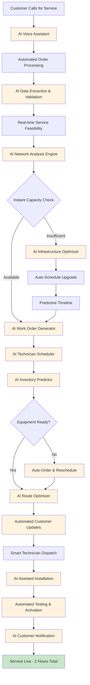

## Current Workflow/User Flow

Here's the detailed step-by-step process that currently takes 3-7 days:

### Detailed Current Process Steps:

**Phase 1: Order Taking (Day 1)**
1. **Customer Call** (15-30 minutes)
2. **Manual Data Entry** (10-15 minutes)
3. **Initial Service Check** (2-4 hours)

**Phase 2: Feasibility & Planning (Days 1-3)**
4. **Network Capacity Analysis** (4-6 hours)
5. **Infrastructure Assessment** (1-2 days if upgrades needed)
6. **Work Order Generation** (30 minutes)

**Phase 3: Scheduling & Resource Allocation (Days 2-4)**
7. **Technician Availability Check** (2-3 hours)
8. **Equipment Inventory Verification** (1-2 hours)
9. **Customer Appointment Scheduling** (Multiple calls, 1-2 hours)

**Phase 4: Installation (Days 3-7)**
10. **Technician Dispatch** (Travel time varies)
11. **Site Survey** (30-60 minutes)
12. **Installation Process** (2-4 hours)
13. **Service Testing & Activation** (30 minutes)

## AI Automation Opportunities in the Workflow

Here's where AI can transform each step of the process:

### AI Automation Points:

**1. AI Voice Assistant & NLP Processing**
- **Technology**: Conversational AI with speech-to-text
- **Function**: Handles customer calls, extracts service requirements, validates customer information
- **Automation**: Replaces manual call center data entry

**2. AI Network Analysis Engine**
- **Technology**: Machine Learning models trained on network topology data
- **Function**: Real-time analysis of network capacity, bandwidth availability, and infrastructure status
- **Automation**: Instant feasibility checks instead of 4-6 hour manual analysis

**3. AI Infrastructure Optimizer**
- **Technology**: Predictive analytics and optimization algorithms
- **Function**: Automatically identifies optimal infrastructure upgrades and schedules them
- **Automation**: Eliminates manual planning delays

**4. AI Technician Scheduler**
- **Technology**: Multi-constraint optimization AI
- **Function**: Considers technician skills, location, availability, and workload to optimize scheduling
- **Automation**: Replaces manual scheduling coordination

**5. AI Inventory Predictor**
- **Technology**: Demand forecasting ML models
- **Function**: Predicts equipment needs and automatically triggers procurement
- **Automation**: Prevents equipment shortages and delays

**6. AI Route Optimizer**
- **Technology**: Geographic AI and traffic prediction
- **Function**: Optimizes technician routes and schedules based on real-time conditions
- **Automation**: Reduces travel time and improves efficiency

**7. AI-Assisted Installation**
- **Technology**: Computer vision and IoT sensors
- **Function**: Guides technicians through installation, detects issues early
- **Automation**: Reduces installation errors and repeat visits

**8. Automated Testing & Activation**
- **Technology**: Network automation and AI monitoring
- **Function**: Automatically tests service quality and activates connections
- **Automation**: Eliminates manual testing procedures