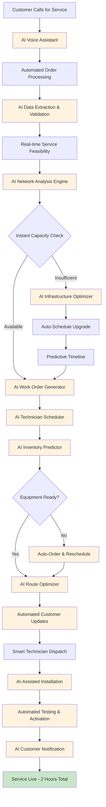

## Current Workflow/User Flow

Here's the detailed step-by-step process that currently takes 3-7 days:

### Detailed Current Process Steps:

**Phase 1: Order Taking (Day 1)**

**1. Customer Call** (15-30 minutes)
- 1.1 Customer dials support number and waits in queue (5-10 minutes)
- 1.2 Call center agent answers and greets customer (1-2 minutes)
- 1.3 Agent verifies customer identity and account information (3-5 minutes)
- 1.4 Customer explains service requirements and preferences (5-8 minutes)
- 1.5 Agent asks clarifying questions about location, speed needs, timeline (3-5 minutes)
- 1.6 Agent provides initial service options and pricing (2-3 minutes)

**2. Manual Data Entry** (10-15 minutes)
- 2.1 Agent opens CRM system and creates new service request (2-3 minutes)
- 2.2 Input customer personal information and contact details (3-4 minutes)
- 2.3 Enter service address and location details (2-3 minutes)
- 2.4 Record service type, speed requirements, and preferences (2-3 minutes)
- 2.5 Add special instructions or customer notes (1-2 minutes)

**3. Initial Service Check** (2-4 hours)
- 3.1 Agent submits request to technical team for review (5 minutes)
- 3.2 Technical team receives and prioritizes the request (30-60 minutes)
- 3.3 Basic address validation and service area confirmation (30-45 minutes)
- 3.4 Preliminary check of existing infrastructure at location (45-90 minutes)
- 3.5 Initial assessment documentation and notes (15-30 minutes)

**Phase 2: Feasibility & Planning (Days 1-3)**

**4. Network Capacity Analysis** (4-6 hours)
- 4.1 Network engineer reviews service address location (30-45 minutes)
- 4.2 Check fiber optic cable availability and proximity (60-90 minutes)
- 4.3 Analyze current network load and bandwidth capacity (45-60 minutes)
- 4.4 Assess distribution point and connection requirements (60-90 minutes)
- 4.5 Review potential network congestion and peak usage (30-45 minutes)
- 4.6 Document capacity analysis findings and recommendations (30-45 minutes)

**5. Infrastructure Assessment** (1-2 days if upgrades needed)
- 5.1 Field survey to assess physical infrastructure needs (2-4 hours)
- 5.2 Evaluate existing conduits, poles, and cable pathways (1-2 hours)
- 5.3 Identify required infrastructure upgrades or installations (2-3 hours)
- 5.4 Coordinate with municipal authorities for permits if needed (4-8 hours)
- 5.5 Plan upgrade timeline and resource requirements (2-4 hours)
- 5.6 Get approval from infrastructure planning team (4-8 hours)

**6. Work Order Generation** (30 minutes)
- 6.1 Compile all assessment data and requirements (10 minutes)
- 6.2 Create detailed work order with specifications (15 minutes)
- 6.3 Assign priority level and complexity rating (5 minutes)

**Phase 3: Scheduling & Resource Allocation (Days 2-4)**

**7. Technician Availability Check** (2-3 hours)
- 7.1 Review technician schedules and current workload (45-60 minutes)
- 7.2 Match technician skills with job requirements (30-45 minutes)
- 7.3 Check geographic proximity and travel considerations (30-45 minutes)
- 7.4 Identify potential scheduling conflicts and alternatives (30-45 minutes)

**8. Equipment Inventory Verification** (1-2 hours)
- 8.1 Check warehouse inventory for required equipment (20-30 minutes)
- 8.2 Verify equipment specifications match service requirements (15-20 minutes)
- 8.3 Reserve equipment for the installation job (10-15 minutes)
- 8.4 Coordinate equipment delivery to technician or site (30-45 minutes)
- 8.5 Update inventory management system (10-15 minutes)

**9. Customer Appointment Scheduling** (Multiple calls, 1-2 hours)
- 9.1 Call customer to propose available time slots (15-20 minutes)
- 9.2 Negotiate appointment time based on customer availability (10-15 minutes)
- 9.3 Confirm appointment details and provide preparation instructions (10-15 minutes)
- 9.4 Send appointment confirmation via SMS/email (5 minutes)
- 9.5 Handle rescheduling requests if conflicts arise (15-30 minutes)
- 9.6 Update scheduling system and notify technician (10-15 minutes)

**Phase 4: Installation (Days 3-7)**

**10. Technician Dispatch** (Travel time varies)
- 10.1 Technician receives work order and reviews requirements (15-20 minutes)
- 10.2 Load equipment and tools into service vehicle (20-30 minutes)
- 10.3 Plan optimal route to customer location (10-15 minutes)
- 10.4 Travel to customer site (30-120 minutes depending on distance)
- 10.5 Check in with dispatch upon arrival (5 minutes)

**11. Site Survey** (30-60 minutes)
- 11.1 Meet with customer and explain installation process (10-15 minutes)
- 11.2 Inspect property and identify optimal installation points (15-20 minutes)
- 11.3 Check existing wiring and connection infrastructure (10-15 minutes)
- 11.4 Identify any unexpected obstacles or complications (5-10 minutes)

**12. Installation Process** (2-4 hours)
- 12.1 Run fiber optic cable from distribution point to premises (60-90 minutes)
- 12.2 Install and configure optical network terminal (ONT) (30-45 minutes)
- 12.3 Set up internal wiring and connection points (45-60 minutes)
- 12.4 Install and configure customer premises equipment (30-45 minutes)
- 12.5 Perform initial connectivity tests (15-30 minutes)

**13. Service Testing & Activation** (30 minutes)
- 13.1 Test internet connectivity and speed performance (10-15 minutes)
- 13.2 Verify all services are functioning correctly (10-15 minutes)
- 13.3 Activate service in network management system (5-10 minutes)
- 13.4 Provide customer with service credentials and instructions (10-15 minutes)
- 13.5 Complete installation documentation and customer sign-off (5-10 minutes)

## AI Automation Opportunities in the Workflow

Here's where AI can transform each step of the process:

### AI Automation Points:

**1. AI Voice Assistant & NLP Processing**
- **Technology**: Conversational AI with speech-to-text
- **Function**: Handles customer calls, extracts service requirements, validates customer information
- **Automation**: Replaces manual call center data entry

**2. AI Network Analysis Engine**
- **Technology**: Machine Learning models trained on network topology data
- **Function**: Real-time analysis of network capacity, bandwidth availability, and infrastructure status
- **Automation**: Instant feasibility checks instead of 4-6 hour manual analysis

**3. AI Infrastructure Optimizer**
- **Technology**: Predictive analytics and optimization algorithms
- **Function**: Automatically identifies optimal infrastructure upgrades and schedules them
- **Automation**: Eliminates manual planning delays

**4. AI Technician Scheduler**
- **Technology**: Multi-constraint optimization AI
- **Function**: Considers technician skills, location, availability, and workload to optimize scheduling
- **Automation**: Replaces manual scheduling coordination

**5. AI Inventory Predictor**
- **Technology**: Demand forecasting ML models
- **Function**: Predicts equipment needs and automatically triggers procurement
- **Automation**: Prevents equipment shortages and delays

**6. AI Route Optimizer**
- **Technology**: Geographic AI and traffic prediction
- **Function**: Optimizes technician routes and schedules based on real-time conditions
- **Automation**: Reduces travel time and improves efficiency

**7. AI-Assisted Installation**
- **Technology**: Computer vision and IoT sensors
- **Function**: Guides technicians through installation, detects issues early
- **Automation**: Reduces installation errors and repeat visits

**8. Automated Testing & Activation**
- **Technology**: Network automation and AI monitoring
- **Function**: Automatically tests service quality and activates connections
- **Automation**: Eliminates manual testing procedures