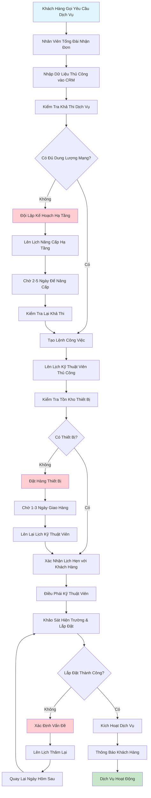

## Quy Trình Làm Việc Hiện Tại/Luồng Người Dùng

Đây là quy trình chi tiết từng bước hiện tại mất 3-7 ngày:

### Các Bước Quy Trình Hiện Tại Chi Tiết:

**Giai Đoạn 1: Tiếp Nhận Đơn Hàng (Ngày 1)**

**1. Cuộc Gọi Khách Hàng** (15-30 phút)
- 1.1 Khách hàng gọi số hỗ trợ và chờ trong hàng đợi (5-10 phút)
- 1.2 Nhân viên tổng đài trả lời và chào khách hàng (1-2 phút)
- 1.3 Nhân viên xác minh danh tính và thông tin tài khoản khách hàng (3-5 phút)
- 1.4 Khách hàng giải thích yêu cầu dịch vụ và sở thích (5-8 phút)
- 1.5 Nhân viên đặt câu hỏi làm rõ về vị trí, nhu cầu tốc độ, thời gian (3-5 phút)
- 1.6 Nhân viên cung cấp các lựa chọn dịch vụ ban đầu và giá cả (2-3 phút)

**2. Nhập Dữ Liệu Thủ Công** (10-15 phút)
- 2.1 Nhân viên mở hệ thống CRM và tạo yêu cầu dịch vụ mới (2-3 phút)
- 2.2 Nhập thông tin cá nhân và chi tiết liên hệ của khách hàng (3-4 phút)
- 2.3 Nhập địa chỉ dịch vụ và chi tiết vị trí (2-3 phút)
- 2.4 Ghi lại loại dịch vụ, yêu cầu tốc độ và sở thích (2-3 phút)
- 2.5 Thêm hướng dẫn đặc biệt hoặc ghi chú khách hàng (1-2 phút)

**3. Kiểm Tra Dịch Vụ Ban Đầu** (2-4 giờ)
- 3.1 Nhân viên gửi yêu cầu đến đội kỹ thuật để xem xét (5 phút)
- 3.2 Đội kỹ thuật nhận và ưu tiên yêu cầu (30-60 phút)
- 3.3 Xác thực địa chỉ cơ bản và xác nhận khu vực dịch vụ (30-45 phút)
- 3.4 Kiểm tra sơ bộ hạ tầng hiện có tại vị trí (45-90 phút)
- 3.5 Tài liệu đánh giá ban đầu và ghi chú (15-30 phút)

**Giai Đoạn 2: Khả Thi & Lập Kế Hoạch (Ngày 1-3)**

**4. Phân Tích Dung Lượng Mạng** (4-6 giờ)
- 4.1 Kỹ sư mạng xem xét vị trí địa chỉ dịch vụ (30-45 phút)
- 4.2 Kiểm tra tính khả dụng và độ gần của cáp quang (60-90 phút)
- 4.3 Phân tích tải mạng hiện tại và dung lượng băng thông (45-60 phút)
- 4.4 Đánh giá điểm phân phối và yêu cầu kết nối (60-90 phút)
- 4.5 Xem xét tắc nghẽn mạng tiềm năng và sử dụng cao điểm (30-45 phút)
- 4.6 Tài liệu hóa kết quả phân tích dung lượng và khuyến nghị (30-45 phút)

**5. Đánh Giá Hạ Tầng** (1-2 ngày nếu cần nâng cấp)
- 5.1 Khảo sát thực địa để đánh giá nhu cầu hạ tầng vật lý (2-4 giờ)
- 5.2 Đánh giá ống dẫn, cột và đường dẫn cáp hiện có (1-2 giờ)
- 5.3 Xác định các nâng cấp hoặc lắp đặt hạ tầng cần thiết (2-3 giờ)
- 5.4 Phối hợp với chính quyền địa phương để xin phép nếu cần (4-8 giờ)
- 5.5 Lập kế hoạch thời gian nâng cấp và yêu cầu tài nguyên (2-4 giờ)
- 5.6 Nhận phê duyệt từ đội lập kế hoạch hạ tầng (4-8 giờ)

**6. Tạo Lệnh Công Việc** (30 phút)
- 6.1 Biên soạn tất cả dữ liệu đánh giá và yêu cầu (10 phút)
- 6.2 Tạo lệnh công việc chi tiết với thông số kỹ thuật (15 phút)
- 6.3 Gán mức độ ưu tiên và xếp hạng độ phức tạp (5 phút)

**Giai Đoạn 3: Lên Lịch & Phân Bổ Tài Nguyên (Ngày 2-4)**

**7. Kiểm Tra Tình Trạng Kỹ Thuật Viên** (2-3 giờ)
- 7.1 Xem xét lịch trình và khối lượng công việc hiện tại của kỹ thuật viên (45-60 phút)
- 7.2 Khớp kỹ năng kỹ thuật viên với yêu cầu công việc (30-45 phút)
- 7.3 Kiểm tra độ gần địa lý và cân nhắc di chuyển (30-45 phút)
- 7.4 Xác định xung đột lịch trình tiềm năng và các lựa chọn thay thế (30-45 phút)

**8. Xác Minh Tồn Kho Thiết Bị** (1-2 giờ)
- 8.1 Kiểm tra tồn kho thiết bị cần thiết tại kho (20-30 phút)
- 8.2 Xác minh thông số thiết bị phù hợp với yêu cầu dịch vụ (15-20 phút)
- 8.3 Đặt trước thiết bị cho công việc lắp đặt (10-15 phút)
- 8.4 Phối hợp giao thiết bị cho kỹ thuật viên hoặc địa điểm (30-45 phút)
- 8.5 Cập nhật hệ thống quản lý tồn kho (10-15 phút)

**9. Lên Lịch Hẹn Khách Hàng** (Nhiều cuộc gọi, 1-2 giờ)
- 9.1 Gọi khách hàng để đề xuất các khung thời gian có sẵn (15-20 phút)
- 9.2 Thương lượng thời gian hẹn dựa trên tình trạng khách hàng (10-15 phút)
- 9.3 Xác nhận chi tiết cuộc hẹn và cung cấp hướng dẫn chuẩn bị (10-15 phút)
- 9.4 Gửi xác nhận cuộc hẹn qua SMS/email (5 phút)
- 9.5 Xử lý yêu cầu đổi lịch nếu có xung đột (15-30 phút)
- 9.6 Cập nhật hệ thống lên lịch và thông báo kỹ thuật viên (10-15 phút)

**Giai Đoạn 4: Lắp Đặt (Ngày 3-7)**

**10. Điều Phái Kỹ Thuật Viên** (Thời gian di chuyển khác nhau)
- 10.1 Kỹ thuật viên nhận lệnh công việc và xem xét yêu cầu (15-20 phút)
- 10.2 Chất thiết bị và công cụ vào xe dịch vụ (20-30 phút)
- 10.3 Lập kế hoạch tuyến đường tối ưu đến vị trí khách hàng (10-15 phút)
- 10.4 Di chuyển đến địa điểm khách hàng (30-120 phút tùy khoảng cách)
- 10.5 Báo cáo với điều phái khi đến nơi (5 phút)

**11. Khảo Sát Hiện Trường** (30-60 phút)
- 11.1 Gặp khách hàng và giải thích quy trình lắp đặt (10-15 phút)
- 11.2 Kiểm tra tài sản và xác định điểm lắp đặt tối ưu (15-20 phút)
- 11.3 Kiểm tra hệ thống dây và hạ tầng kết nối hiện có (10-15 phút)
- 11.4 Xác định bất kỳ trở ngại hoặc phức tạp không mong muốn nào (5-10 phút)

**12. Quy Trình Lắp Đặt** (2-4 giờ)
- 12.1 Chạy cáp quang từ điểm phân phối đến cơ sở (60-90 phút)
- 12.2 Lắp đặt và cấu hình thiết bị đầu cuối mạng quang (ONT) (30-45 phút)
- 12.3 Thiết lập hệ thống dây nội bộ và điểm kết nối (45-60 phút)
- 12.4 Lắp đặt và cấu hình thiết bị tại cơ sở khách hàng (30-45 phút)
- 12.5 Thực hiện kiểm tra kết nối ban đầu (15-30 phút)

**13. Kiểm Tra Dịch Vụ & Kích Hoạt** (30 phút)
- 13.1 Kiểm tra kết nối internet và hiệu suất tốc độ (10-15 phút)
- 13.2 Xác minh tất cả dịch vụ hoạt động chính xác (10-15 phút)
- 13.3 Kích hoạt dịch vụ trong hệ thống quản lý mạng (5-10 phút)
- 13.4 Cung cấp cho khách hàng thông tin đăng nhập dịch vụ và hướng dẫn (10-15 phút)
- 13.5 Hoàn thành tài liệu lắp đặt và ký xác nhận khách hàng (5-10 phút)

## Cơ Hội Tự Động Hóa AI trong Quy Trình Làm Việc

Đây là nơi AI có thể biến đổi từng bước của quy trình:

```mermaid
flowchart TD
    A[Khách Hàng Gọi Yêu Cầu Dịch Vụ] --> A1[🤖 Trợ Lý Giọng Nói AI]
    A1 --> B[Xử Lý Đơn Hàng Tự Động]
    B --> B1[🤖 AI Trích Xuất & Xác Thực Dữ Liệu]
    B1 --> C[Khả Thi Dịch Vụ Thời Gian Thực]
    C --> C1[🤖 Công Cụ Phân Tích Mạng AI]
    C1 --> D{Kiểm Tra Dung Lượng Tức Thì}
    D -->|Không Đủ| E[🤖 Bộ Tối Ưu Hóa Hạ Tầng AI]
    E --> F[Tự Động Lên Lịch Nâng Cấp]
    F --> G[Thời Gian Dự Đoán]
    D -->|Có Sẵn| H[🤖 Bộ Tạo Lệnh Công Việc AI]
    G --> H
    H --> I[🤖 Bộ Lên Lịch Kỹ Thuật Viên AI]
    I --> J[🤖 Bộ Dự Đoán Tồn Kho AI]
    J --> K{Thiết Bị Sẵn Sàng?}
    K -->|Không| L[🤖 Tự Động Đặt Hàng & Đổi Lịch]
    K -->|Có| M[🤖 Bộ Tối Ưu Tuyến Đường AI]
    L --> M
    M --> N[🤖 Cập Nhật Khách Hàng Tự Động]
    N --> O[Điều Phái Kỹ Thuật Viên Thông Minh]
    O --> P[🤖 Lắp Đặt Hỗ Trợ AI]
    P --> Q[🤖 Kiểm Tra & Kích Hoạt Tự Động]
    Q --> R[🤖 Thông Báo Khách Hàng AI]
    R --> S[Dịch Vụ Hoạt Động - Tổng Cộng 2 Giờ]

    style A1 fill:#fff3e0
    style B1 fill:#fff3e0
    style C1 fill:#fff3e0
    style E fill:#fff3e0
    style H fill:#fff3e0
    style I fill:#fff3e0
    style J fill:#fff3e0
    style L fill:#fff3e0
    style M fill:#fff3e0
    style N fill:#fff3e0
    style P fill:#fff3e0
    style Q fill:#fff3e0
    style R fill:#fff3e0
    style S fill:#c8e6c9
```

### Điểm Tự Động Hóa AI:

**1. Trợ Lý Giọng Nói AI & Xử Lý NLP**
- **Công Nghệ**: AI đối thoại với chuyển giọng nói thành văn bản
- **Chức Năng**: Xử lý cuộc gọi khách hàng, trích xuất yêu cầu dịch vụ, xác thực thông tin khách hàng
- **Tự Động Hóa**: Thay thế việc nhập dữ liệu thủ công tại tổng đài

**2. Công Cụ Phân Tích Mạng AI**
- **Công Nghệ**: Mô hình Machine Learning được đào tạo trên dữ liệu cấu trúc mạng
- **Chức Năng**: Phân tích thời gian thực dung lượng mạng, tính khả dụng băng thông và trạng thái hạ tầng
- **Tự Động Hóa**: Kiểm tra khả thi tức thì thay vì phân tích thủ công 4-6 giờ

**3. Bộ Tối Ưu Hóa Hạ Tầng AI**
- **Công Nghệ**: Phân tích dự đoán và thuật toán tối ưu hóa
- **Chức Năng**: Tự động xác định các nâng cấp hạ tầng tối ưu và lên lịch chúng
- **Tự Động Hóa**: Loại bỏ độ trễ lập kế hoạch thủ công

**4. Bộ Lên Lịch Kỹ Thuật Viên AI**
- **Công Nghệ**: AI tối ưu hóa đa ràng buộc
- **Chức Năng**: Xem xét kỹ năng, vị trí, tình trạng và khối lượng công việc của kỹ thuật viên để tối ưu hóa lịch trình
- **Tự Động Hóa**: Thay thế phối hợp lên lịch thủ công

**5. Bộ Dự Đoán Tồn Kho AI**
- **Công Nghệ**: Mô hình ML dự báo nhu cầu
- **Chức Năng**: Dự đoán nhu cầu thiết bị và tự động kích hoạt mua sắm
- **Tự Động Hóa**: Ngăn ngừa thiếu hụt thiết bị và độ trễ

**6. Bộ Tối Ưu Tuyến Đường AI**
- **Công Nghệ**: AI địa lý và dự đoán giao thông
- **Chức Năng**: Tối ưu hóa tuyến đường và lịch trình kỹ thuật viên dựa trên điều kiện thời gian thực
- **Tự Động Hóa**: Giảm thời gian di chuyển và cải thiện hiệu quả

**7. Lắp Đặt Hỗ Trợ AI**
- **Công Nghệ**: Thị giác máy tính và cảm biến IoT
- **Chức Năng**: Hướng dẫn kỹ thuật viên qua quá trình lắp đặt, phát hiện sớm vấn đề
- **Tự Động Hóa**: Giảm lỗi lắp đặt và chuyến thăm lặp lại

**8. Kiểm Tra & Kích Hoạt Tự Động**
- **Công Nghệ**: Tự động hóa mạng và giám sát AI
- **Chức Năng**: Tự động kiểm tra chất lượng dịch vụ và kích hoạt kết nối
- **Tự Động Hóa**: Loại bỏ quy trình kiểm tra thủ công